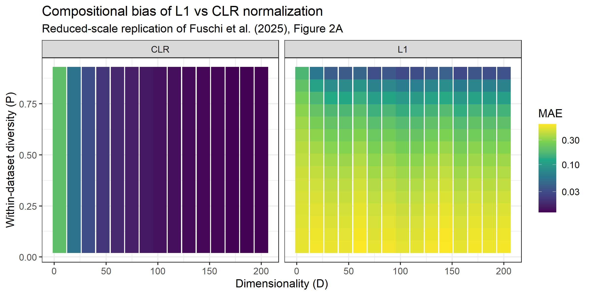
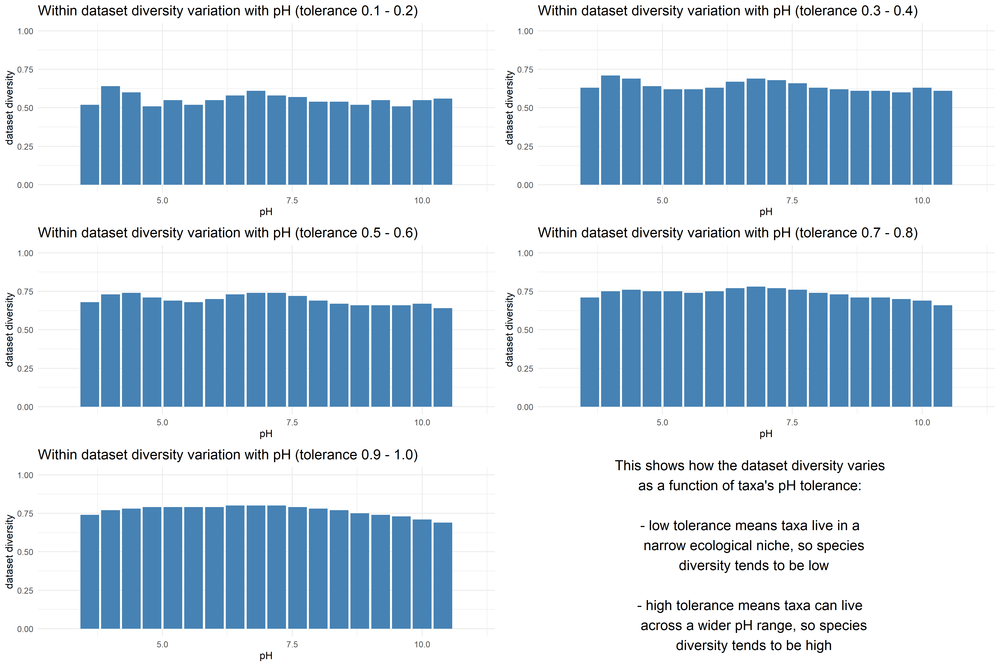

# Objective

This project investigates two questions that follow directly from a central claim of Fuschi et al. (2025): the centered log-ratio (CLR) transformation, combined with Pearson's correlation, reliably estimates taxon-taxon correlations in compositional metagenomic data, and this reliability improves with dimensionality (the "blessing of dimensionality").

1.  *How much* compositional bias does CLR actually remove compared to a simpler normalization (L1), and how does this depend on the number of taxa (D) and on within-dataset diversity (P)?
2.  Can the sparsity patterns typically simulated to test this kind of method be made more biologically realistic, instead of relying on a single, arbitrary zero-inflation parameter shared by every taxon?

The first question is addressed by replicating, on a reduced scale, Section 3.1 of the original paper. The second is addressed by extending the paper's simulation framework with a pH-driven sparsity mechanism.

# Approach

## Compositional bias as a function of Dimensionality (D) and within-dataset diversity (P)

The bias introduced by a normalization method cannot be measured on real data, since the true correlation between taxa is unknown. Following the original paper, the ground truth used here is a fully uncorrelated dataset (every true correlation equal to zero): any non-zero correlation observed after normalization can then be attributed entirely to the normalization method itself.

For each combination of dimensionality (D) and within-dataset diversity (P) on a grid, uncorrelated Gaussian data is generated and its diversity is tuned to the target P via a numerical root search. Both L1 and CLR normalizations are then applied, and the resulting correlation matrix is compared against the known (zero) ground truth using the mean absolute error (MAE), as defined by Fuschi et al. (2025).

The grid used here is a reduced version of the paper's:

- 15x15 combinations of D and P, instead of the paper's 40x39;
- N = 5,000 samples per dataset, instead of 10,000.

This reduction was chosen to keep computation time manageable within the scope of this project.

## A biologically motivated sparsity mechanism

The original paper's synthetic data generation follows the "Normal to Anything" (NorTA) approach: correlated normal variables, built from a controlled correlation matrix, are converted to uniform percentiles and mapped through the quantile function of a zero-inflated negative binomial (ZINB) distribution, using a single zero-inflation parameter shared by every taxon.

This project replaces that single shared parameter with a per-taxon zero-inflation probability, derived from the distance between a simulated environmental pH and each taxon's own pH optimum: taxa well matched to the environment are assigned a low zero-inflation probability, poorly matched taxa a high one. Everything else in the NorTA pipeline (the correlation matrix, the conversion to uniform percentiles, the ZINB mapping) is unchanged. This mechanism is then used to simulate how community evenness (measured by the mean Pielou index, P) responds to a pH gradient, under five different scenarios of taxon pH tolerance, from narrow ("specialist") to wide ("generalist").

# Results

## Compositional bias

The heatmap produced by `compositional_bias_D_P.R` (Figure 1) shows the MAE of each normalization method across the D-by-P grid. In line with the original paper's findings, the two methods fail in qualitatively different ways:

- L1's error is driven primarily by diversity, growing worse as abundance concentrates in fewer taxa, largely independently of dimensionality;
- CLR's error, by contrast, is largely insensitive to diversity but decreases as dimensionality grows, consistent with the "blessing of dimensionality" the original paper describes.

The reduced grid used here reproduces this same qualitative pattern, even with roughly a third of the paper's resolution and half its sample size.

## pH-driven diversity

The comparison produced by `ph_dataset_diversity_confrontation.R` (Figure 2) tracks within-dataset diversity across a pH gradient, for each of the five pH-tolerance scenarios. Narrow-tolerance ("specialist") communities show lower and noisier diversity across the gradient, since only taxa whose optimum happens to be close to the current environmental pH remain well represented. Wide-tolerance ("generalist") communities, by contrast, stay close to maximal, stable diversity across the whole gradient, since most taxa remain reasonably well matched to the environment regardless of its exact pH.

# Limitations

- **Reduced scale.** Both the D-by-P grid (15x15 vs. 40x39) and the sample size per dataset (N = 5,000 vs. 10,000) are smaller than in the original paper, for time constraints. The qualitative pattern is preserved, but the exact MAE values are not directly comparable to the paper's.
- **No real-data validation of the pH-driven mechanism.** The original paper's CLR + Pearson pipeline is validated on the real HMP2 dataset. The pH-driven sparsity extension proposed here, being a novel addition to the simulation framework rather than a replication, has only been tested on simulated data, not against any real environmental dataset.
- **Marginal, not partial, correlation.** Following the original paper's own choice, this project uses marginal correlations throughout, which keep the compositional-bias analysis straightforward but do not remove the influence of indirect, taxon-mediated associations.
- **Toy-scale real-data demonstration.** The `clr_pearson.R` pipeline is demonstrated in the notebook on a small simulated OTU table, not on the full HMP2 dataset used by the original paper (over 1000 taxa), so it should be read as a demonstration of the pipeline's mechanics rather than a large-scale replication of the paper's real-data results.

# Conclusion

This project's two research questions were both addressed within the same simulation framework used by the original paper. On compositional bias, the results confirm the paper's central finding: CLR consistently outperforms L1 at removing spurious correlation, and the gap between the two widens as dimensionality grows. On sparsity, making the zero-inflation mechanism pH-driven, rather than a single shared parameter, produces the expected ecological pattern: specialist taxa generate lower, noisier diversity, while generalist taxa keep it high and stable across the environmental gradient.
